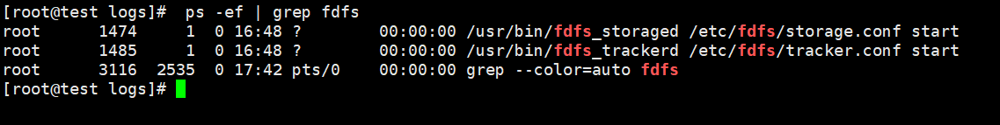

# linux  部署 fastdfs 

## 准备安装包


- [fastdfs-master.zip](https://github.com/happyfish100/fastdfs.git)
- [libfastcommon-master.zip](https://github.com/happyfish100/fastdfs-nginx-module.git)
- [fastdfs-nginx-module-master.zip](https://github.com/happyfish100/fastdfs-nginx-module.git)
- [libserverframe-master.zip](https://github.com/happyfish100/libserverframe.git)

将3个文件上传到/usr/local目录下

## 安装

#### 1.解压前准备基础环境

```yum -y install unzip zip gcc-c++```

#### 2.分别解压

```
cd /usr/local
unzip fastdfs-master.zip
unzip libfastcommon-master.zip
unzip fastdfs-nginx-module-master.zip
unzip libserverframe-master.zip
```

#### 3.安装

```
cd /usr/local/libfastcommon-master
./make.sh clean && ./make.sh && ./make.sh install
# 设置类库软连接
ln -s /usr/lib64/libfastcommon.so /usr/local/lib/libfastcommon.so
ln -s /usr/lib64/libfastcommon.so /usr/lib/libfastcommon.so
ln -s /usr/lib64/libfdfsclient.so /usr/local/lib/libfdfsclient.so
ln -s /usr/lib64/libfdfsclient.so /usr/lib/libfdfsclient.so

cd /usr/local/libserverframe-master
./make.sh clean && ./make.sh && ./make.sh install

cd /usr/local/fastdfs-master
./make.sh clean && ./make.sh && ./make.sh install
```

#### 4.配置文件路径

创建tracker和storaged的文件夹
```
mkdir -p /home/fastdfs_tracker
mkdir -p /home/fastdfs_storaged
mkdir -p /home/fastdfs_storaged_data
```


#### 5.修改配置文件

```vi /etc/fdfs/tracker.conf```

```
base_path=/home/fastdfs_tracker # 设置存储目录
http.server_port=6666 # 设置http端口，默认是8080
```
```vi /etc/fdfs/storage.conf```

```
base_path=/opt/fastdfs_storage # 设置数据文件、日志目录
store_path_count=1 # 存储路径个数，需要与store_path个数匹配
store_path0=/home/fastdfs_storaged_data # 设置存储路径
tracker_server=192.168.21.142:22122 # tracker服务器地址，集群时写法192.168.21.142:22122,192.168.21.143:22122，
http.server_port=6667 # 设置http端口
```
::: warning 注意点：
tracker_server 不允许使用127.0.0.1，若未修改，则启动时/home/fastdfs_storaged/logs/storaged.log 中会给出提示
:::

#### 6.创建软连接

```
ln -s /usr/bin/fdfs_trackerd /usr/local/bin
ln -s /usr/bin/stop.sh /usr/local/bin
ln -s /usr/bin/restart.sh /usr/local/bin
ln -s /usr/bin/fdfs_storaged /usr/local/bin # 创建软连接
```

#### 7.启动，停止，状态

先启动tracker
```
service fdfs_trackerd start # 启动
service fdfs_trackerd stop # 停止
service fdfs_trackerd status # 服务状态
```
再启动storage
```
service fdfs_storaged start # 启动
service fdfs_storaged stop # 停止
service fdfs_storaged status # 服务状态
```

如果这两个启动命令不好使，通过status可以看到它调用的脚本

```/usr/bin/fdfs_trackerd /etc/fdfs/tracker.conf start```

```/usr/bin/fdfs_storaged /etc/fdfs/storage.conf start```

#### 8.检查是否已启动
```ps -ef | grep fdfs```



#### 9.加入自启动

fdfs_tracker设置开机启动
```
cp /usr/local/fastdfs-master/init.d/fdfs_trackerd /etc/init.d/
chkconfig --add fdfs_trackerd
chkconfig fdfs_trackerd on
```
fdfs_storafed设置开机启动
```
cp /usr/local/fastdfs-master/init.d/fdfs_storaged /etc/init.d/
chkconfig --add fdfs_storaged
chkconfig fdfs_storaged on
```
